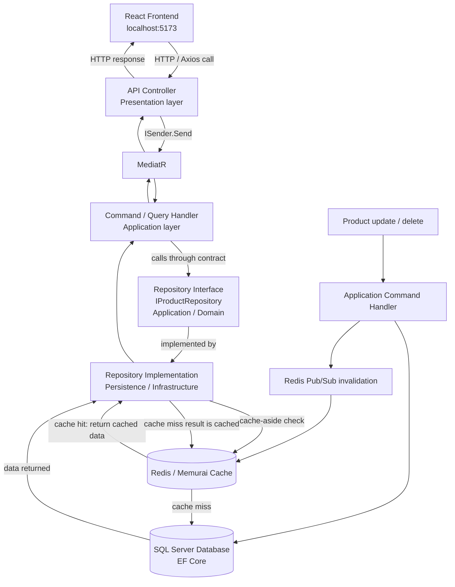

# Cache Optimizer Pro - Project Guide

## 1. Project Overview

Cache Optimizer Pro is a full-stack distributed caching system for managing products while reducing repeated database work. It uses Redis for fast cache reads and SQL Server for durable storage, with a React dashboard for operations and live metrics.

It solves the performance and scalability problem of repeatedly querying a database for the same data by combining cache-aside reads, write-through writes, cache invalidation, and runtime cache configuration.

### Technology Stack

**Backend**

- .NET 9 and ASP.NET Core Web API
- Clean Architecture
- MediatR and CQRS-style commands and queries
- Entity Framework Core
- SQL Server / SQL Server Express
- Redis-compatible cache through StackExchange.Redis
- Serilog structured logging
- xUnit, Moq, and FluentAssertions for tests

**Frontend**

- React with Vite
- JavaScript and JSX
- Axios for HTTP requests
- React Router for navigation
- Zustand for shared state
- Recharts for metrics visualizations
- PropTypes for runtime prop validation
- Responsive CSS dashboard styling

## 2. How to Run This Project

### One-time Prerequisites

Check that SQL Server Express and Memurai are running:

```powershell
Get-Service 'MSSQL$SQLEXPRESS'
Get-Service Memurai
```

Both services should report `Running`.

The SQL Server database must be named `CacheOptimizerDB`. The database schema migration is already present under `src/Persistence/Migrations`. If the schema has not been applied, run this once from the repository root:

```powershell
dotnet ef database update --project src/Persistence --startup-project src/App
```

Redis/Memurai should listen on `localhost:6379`.

### Terminal 1 - Backend

From the project root:

```powershell
cd src/App
dotnet run
```

The backend URLs are:

- HTTPS API: `https://localhost:7259`
- HTTP API: `http://localhost:5239`
- OpenAPI JSON in Development: `http://localhost:5239/openapi/v1.json`

For a clean shell where the .NET executable is not on PATH, use:

```powershell
& 'C:\Program Files\dotnet\dotnet.exe' run --project src/App/App.csproj --launch-profile https
```

### Terminal 2 - Frontend

From the project root:

```powershell
cd frontend
npm install
npm run dev
```

The frontend URL is:

- `http://localhost:5173`

The frontend API base URL is configured in `frontend/.env` as `https://localhost:7259/api`.

### Daily Startup Checklist

1. Confirm SQL Server Express is running.
2. Confirm Memurai is running.
3. Confirm the SQL Server migration has been applied.
4. Start the backend in Terminal 1.
5. Start the frontend in Terminal 2.
6. Open `http://localhost:5173`.

## 3. Complete Architecture Flow



## 4. Explanation of Each Layer

**Frontend:** React components render the user interface. Axios sends product, metrics, and cache-configuration requests to the backend API.

**Controller:** Controllers receive HTTP requests, bind request data, send commands or queries through MediatR, and convert results into HTTP responses. They do not call repositories or the database directly.

**MediatR:** MediatR is the messenger between controllers and application use cases. It keeps HTTP concerns separate from business orchestration and makes handlers independently testable.

**Handler:** Application handlers implement each use case. They validate the request, apply orchestration rules, choose the cache-aware operation, and coordinate repository and invalidation interfaces.

**Repository Interface:** `IProductRepository` is a contract that describes how product data can be read or changed without exposing where that data is stored.

**Repository Implementation:** `ProductRepository` contains the actual EF Core data-access code. It uses `ApplicationDbContext` to query and update SQL Server.

**Redis Cache:** Redis or Memurai is fast temporary storage. It avoids repeated SQL Server queries for frequently requested products and supports Pub/Sub invalidation across application instances.

**SQL Server:** SQL Server is the durable source of record for product data. EF Core maps the `Product` entity to the `Products` table.

## 5. Feature List

| Feature | API Endpoint | What it does |
|---|---|---|
| Products CRUD | `GET/POST/PUT/DELETE /api/products` | Lists, creates, updates, and deletes products through MediatR handlers and repository abstractions. |
| Product detail | `GET /api/products/{id}` | Reads a product using a cache-aside Redis lookup with SQL Server fallback. |
| Metrics Dashboard | `GET /api/metrics` | Returns cache hits, misses, total operations, hit ratio, and average hit/miss response times. |
| Cache Config | `GET/POST /api/cache-config` | Reads or changes cache expiration and strategy at runtime. |
| Rate Limiting | All API routes | Applies a per-IP fixed-window limit of 100 requests per minute. |
| Cache Invalidation | Internal Redis Pub/Sub flow | Removes stale product cache entries after update or delete operations. |

## 6. Common Issues and Fixes

### `Products` table is missing

Apply the migration from the repository root:

```powershell
dotnet ef database update --project src/Persistence --startup-project src/App
```

If creating the migration on a new database, use:

```powershell
dotnet ef migrations add InitialCreate --project src/Persistence --startup-project src/App
dotnet ef database update --project src/Persistence --startup-project src/App
```

### Redis connection failed

Check Memurai:

```powershell
Get-Service Memurai
```

Start it if necessary:

```powershell
Start-Service Memurai
```

Then verify port `6379`:

```powershell
Test-NetConnection localhost -Port 6379
```

### File locked during build (`MSB3027`)

Stop the running backend before building or running EF migrations:

```powershell
Get-CimInstance Win32_Process -Filter "name = 'dotnet.exe'" | Select-Object ProcessId,CommandLine
taskkill /PID <backend-process-id> /T /F
```

Then run the build or migration command again.

### Frontend cannot find `package.json`

Make sure the terminal is inside the frontend directory:

```powershell
cd frontend
npm install
npm run dev
```

### HTTPS certificate warning

Use the HTTP API URL for local API testing:

```text
http://localhost:5239
```

Or trust the local ASP.NET Core development certificate with:

```powershell
dotnet dev-certs https --trust
```

## 7. Talking Points

- Implemented Clean Architecture with clear separation between Presentation, Application, Domain, Persistence, and Infrastructure layers.
- Used the Repository Pattern and Dependency Inversion so handlers depend on interfaces rather than database implementations.
- Applied Cache-Aside and Write-Through caching strategies with Redis/Memurai to reduce SQL Server latency and improve performance.
- Added Redis Pub/Sub cache invalidation, runtime cache configuration, rate limiting, and a React metrics dashboard for operational visibility.
