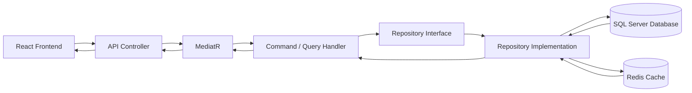
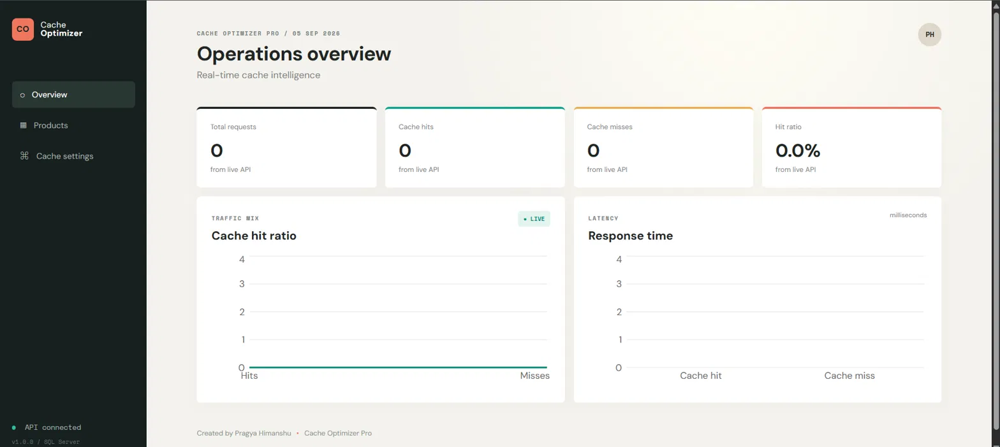
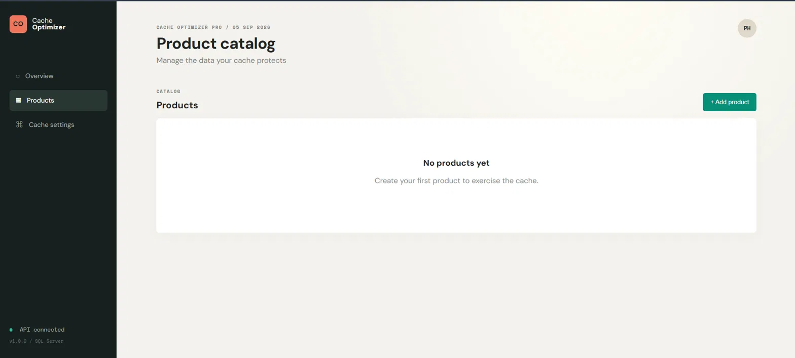
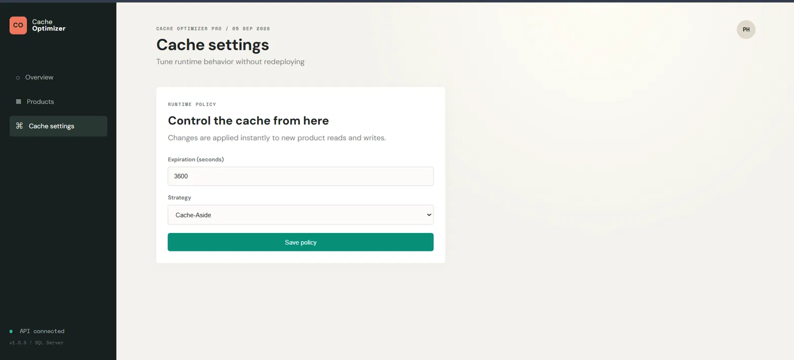
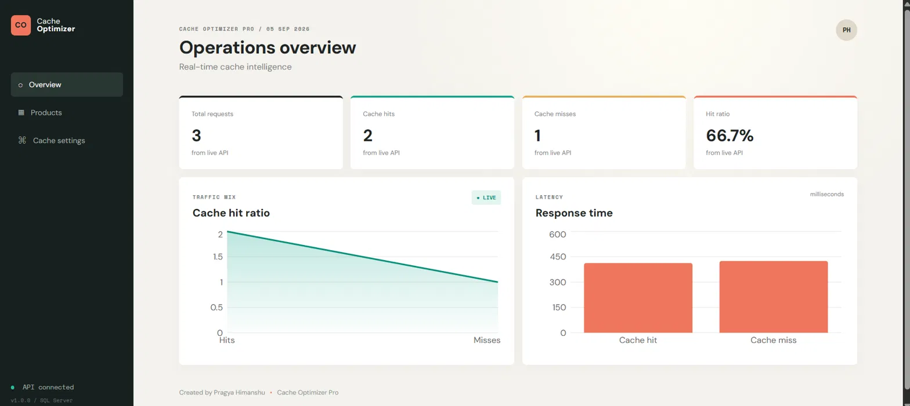
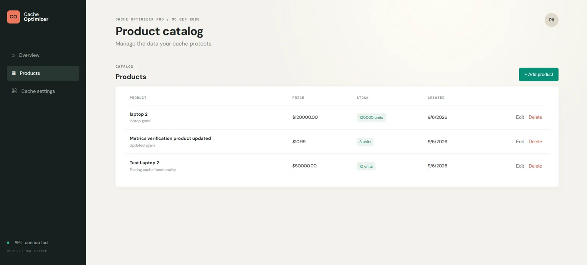

# 🚀 CacheOptimizerPro

    
**Author: Pragya Himanshu**

A high-performance, full-stack distributed caching system built with **.NET 9**, **SQL Server**, **Redis**, and **React**. It demonstrates cache-aside and write-through caching strategies, Redis Pub/Sub cache invalidation, runtime-configurable cache policy, and a live operations dashboard — all wrapped in Clean Architecture.

---

## 🔥 Key Features

✅ **Distributed Caching** – Uses Redis (Memurai on Windows) for low-latency, high-speed caching.
✅ **Cache Invalidation** – Redis Pub/Sub removes stale product cache entries after update/delete.
✅ **Multiple Caching Strategies**:
  - **Cache-Aside** (Lazy Loading) – Reads check Redis first, fall back to SQL Server on miss.
  - **Write-Through** – Writes update SQL Server and Redis in the same operation.
✅ **Runtime Cache Configuration** – Change expiration time and strategy via API, no redeploy needed.
✅ **Live Metrics Dashboard** – React + Recharts dashboard showing cache hit ratio and response times.
✅ **Rate Limiting** – Per-IP fixed window limit (100 requests/minute).
✅ **Clean Architecture** – Domain, Application, Infrastructure, Persistence, and Presentation layers, fully separated.
✅ **Repository Pattern** – Handlers depend on interfaces, not concrete database code.

---

## 🛠️ Technologies Used

**Backend:** .NET 9 · ASP.NET Core Web API · MediatR (CQRS) · Entity Framework Core · SQL Server · Redis / Memurai · Serilog · xUnit

**Frontend:** React + Vite (JavaScript) · Axios · React Router · Zustand · Recharts · PropTypes · Tailwind CSS

---

## 🏛️ Architecture



- 📌 **Domain Layer** – Entities and core business rules.
- 📌 **Application Layer** – Commands, queries, and handlers (business logic).
- 📌 **Infrastructure / Persistence Layer** – Redis integration and repository implementations.
- 📌 **Presentation Layer** – API controllers, HTTP-only, no business logic.

---

## 🖥️ Application Screenshots

### Operations Dashboard



### Product Catalog



### Cache Settings



### Dashboard Metrics



### Products with Cache Activity



---

## 🔄 How It Works

**1️⃣ Cache-Aside (Lazy Loading)**
`GET /api/products/{id}` checks Redis first. On a miss, it loads from SQL Server, stores it in Redis, and returns it.

**2️⃣ Write-Through**
`POST /api/products` writes to SQL Server and updates its Redis cache entry in the same operation.

**3️⃣ Cache Invalidation**
Update/delete commands save the database change, then publish a Redis Pub/Sub message for `products:{id}` so stale copies are removed.

---

## 🚀 Getting Started

### 📌 Prerequisites

- [.NET 9 SDK](https://dotnet.microsoft.com/download/dotnet/9.0)
- [Node.js LTS](https://nodejs.org/en/download)
- [SQL Server Express](https://www.microsoft.com/en-us/sql-server/sql-server-downloads)
- [Memurai (Redis for Windows)](https://www.memurai.com/get-memurai)

Verify services are running:

```powershell
Get-Service 'MSSQL$SQLEXPRESS'
Get-Service Memurai
```

### Step 1: Clone the Repository

```powershell
git clone https://github.com/pragyahimanshu/CacheOptimizerPro.git
cd CacheOptimizerPro
dotnet restore
```

### Step 2: Set Up the Database

```powershell
dotnet ef migrations add InitialCreate --project src/Persistence --startup-project src/App --output-dir Migrations
dotnet ef database update --project src/Persistence --startup-project src/App
```

Update the connection string in `src/App/appsettings.json` if needed:

```text
Server=YOUR_SERVER_NAME\SQLEXPRESS;Database=CacheOptimizerDB;Trusted_Connection=True;TrustServerCertificate=True
```

### Step 3: Run the Backend

```powershell
dotnet run --project src/App/App.csproj --launch-profile https
```

API available at `https://localhost:7259` and `http://localhost:5239`. OpenAPI JSON at `/openapi/v1.json`.

### Step 4: Run the Frontend

```powershell
cd frontend
npm install
npm run dev
```

Open `http://localhost:5173` in your browser.

---

## 🌐 API Endpoints

| Method | Endpoint | Description |
|--------|----------|-------------|
| GET | `/api/products` | List all products |
| POST | `/api/products` | Create a product (Write-Through) |
| GET | `/api/products/{id}` | Fetch a product (Cache-Aside) |
| PUT | `/api/products/{id}` | Update a product (invalidates cache) |
| DELETE | `/api/products/{id}` | Delete a product (invalidates cache) |
| GET | `/api/metrics` | Live cache hits, misses, hit ratio, response times |
| GET/POST | `/api/cache-config` | View or change cache expiration/strategy at runtime |

**Example create payload:**

```json
{
  "name": "Edge Cache Node",
  "description": "A product used to exercise distributed caching",
  "price": 149.99,
  "stockQuantity": 25
}
```

---

**Manual testing:** Use Swagger/OpenAPI or Postman to create, fetch, and delete a product, then check `/api/metrics` to see the cache hit ratio change.

---

## 🎯 Why This Project

✅ Demonstrates real-world caching patterns (Cache-Aside, Write-Through) used in production systems.
✅ Clean Architecture with Repository Pattern for maintainability and testability.
✅ Runtime-configurable cache policy — no redeploy needed to tune performance.
✅ Full-stack: a working React dashboard, not just a backend API.
✅ Built-in operational visibility via live metrics, not just a theoretical caching demo.

---

## 👩‍💻 Author

**Created by Pragya Himanshu**

